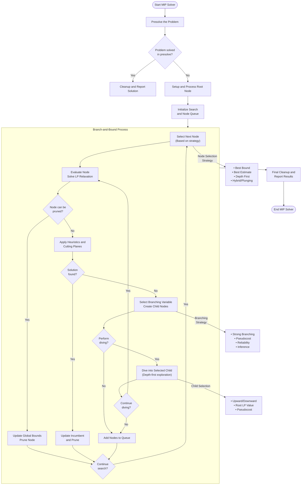

```mermaid
flowchart TD
    Start([Start MIP Solver]) --> Presolve["Presolve the Problem"]
    
    Presolve --> CheckPresolved{"Problem solved\nin presolve?"}
    CheckPresolved -->|Yes| Cleanup["Cleanup and Report Solution"]
    
    CheckPresolved -->|No| Setup["Setup and Process Root Node"]
    
    Setup --> InitSearch["Initialize Search\nand Node Queue"]
    InitSearch --> MainLoop["Main Branch-and-Bound Loop"]
    
    subgraph MainLoop["Branch-and-Bound Process"]
        SelectNode["Select Next Node\n(Based on strategy)"] --> EvaluateNode["Evaluate Node\nSolve LP Relaxation"]
        
        EvaluateNode --> NodeCheck{"Node can be\npruned?"}
        NodeCheck -->|Yes| UpdateBounds["Update Global Bounds\nPrune Node"]
        
        NodeCheck -->|No| HeuristicsAndCuts["Apply Heuristics and\nCutting Planes"]
        
        HeuristicsAndCuts --> SolutionCheck{"Solution\nfound?"}
        SolutionCheck -->|Yes| UpdateIncumbent["Update Incumbent\nand Prune"]
        SolutionCheck -->|No| Branch["Select Branching Variable\nCreate Child Nodes"]
        
        UpdateBounds --> Continue{"Continue\nsearch?"}
        UpdateIncumbent --> Continue
        Branch --> DivingCheck{"Perform\ndiving?"}
        
        DivingCheck -->|Yes| Dive["Dive into Selected Child\n(Depth-first exploration)"]
        DivingCheck -->|No| QueueNodes["Add Nodes to Queue"]
        
        Dive --> ContinueDive{"Continue\ndiving?"}
        ContinueDive -->|Yes| EvaluateNode
        ContinueDive -->|No| QueueNodes
        
        QueueNodes --> Continue
        Continue -->|Yes| SelectNode
    end
    
    MainLoop --> FinalCleanup["Final Cleanup and\nReport Results"]
    FinalCleanup --> End([End MIP Solver])
    
    %% Strategy decision points
    SelectNode -->|"Node Selection\nStrategy"| StrategyNote1["• Best Bound\n• Best Estimate\n• Depth First\n• Hybrid/Plunging"]
    
    Branch -->|"Branching\nStrategy"| StrategyNote2["• Strong Branching\n• Pseudocost\n• Reliability\n• Inference"]
    
    Dive -->|"Child Selection"| StrategyNote3["• Upward/Downward\n• Root LP Value\n• Pseudocost"]
```
